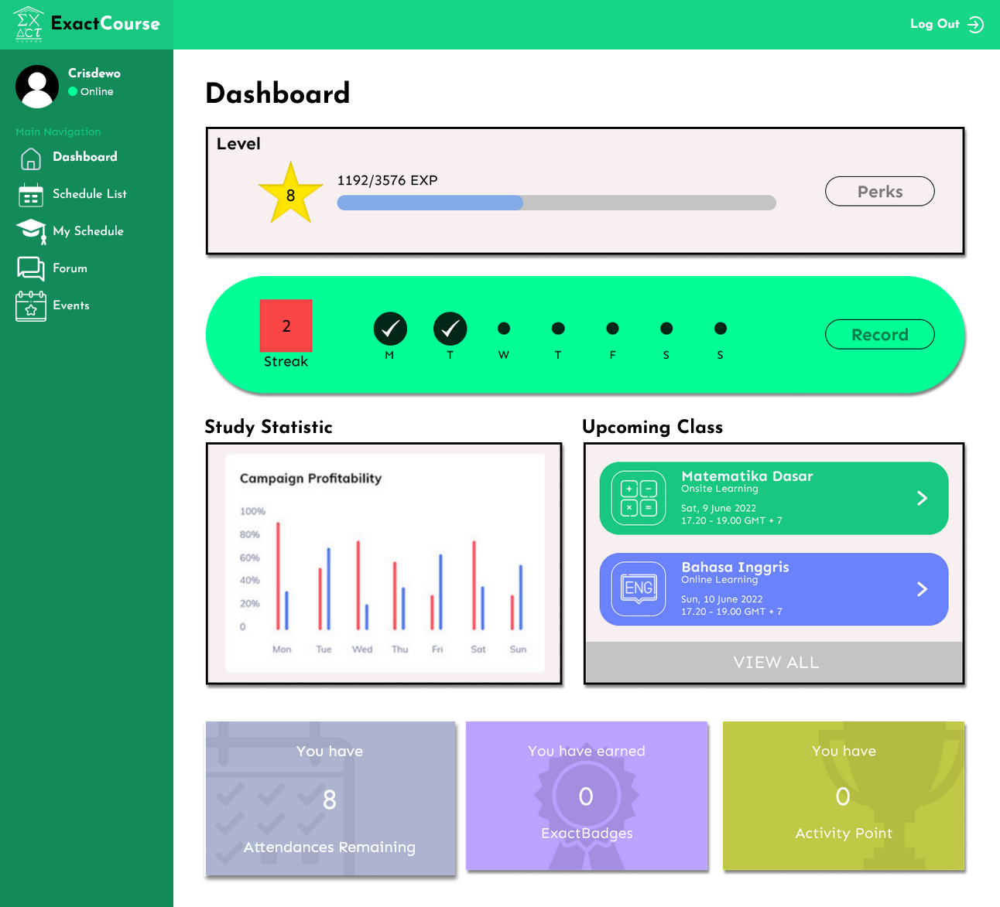
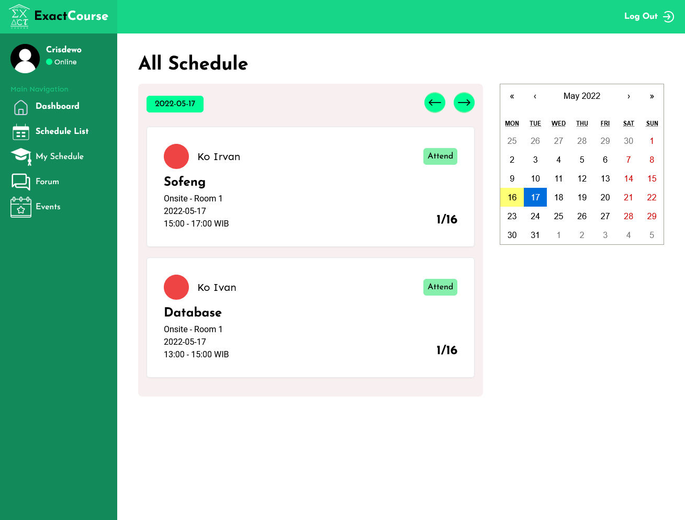
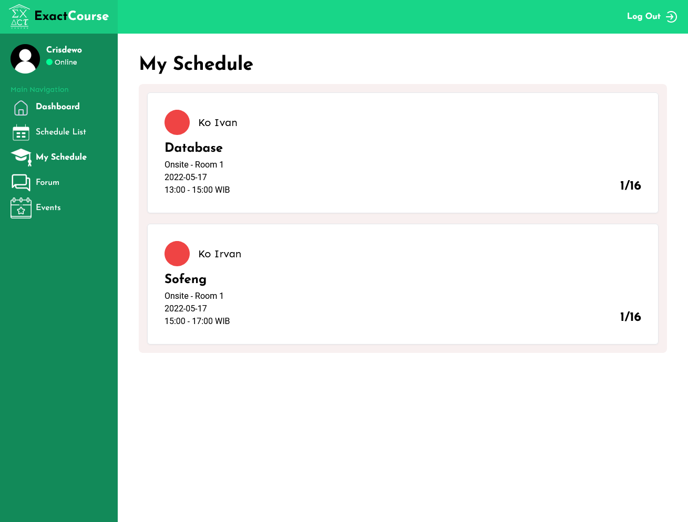

<h1 align="center">Exact Course </h1>
<p>
  
  <a href="#" target="_blank">
    
  </a>
</p>

## About The Project

Exact course is a web application that is used by students and mentors as a learning management system in a course environment.

### Screenshots






### Built With

- [**Backend**](./mern-tutorial/backend/)
  - [MongoDB](https://www.mongodb.com/)
  - [Mongoose](https://mongoosejs.com/)
  - [Express](https://expressjs.com/)
- [**Frontend**](./mern-tutorial/frontend/)
  - [React](https://reactjs.org/)

## Install

1. Clone the repo
   ```sh
   git clone https://github.com/HiImHibiki/ExactCourse.git
   ```
2. `cd` into repo and install NPM packages
   ```sh
   cd ExactCourse
   npm install
   ```
3. Copy `.env.example` to `.env` and fill in your credentials

## Usage

- Backend
  ```sh
  npm run server
  ```
- Frontend
  ```sh
  npm run client
  ```
- Backend & Frontend
  ```sh
  npm run dev
  ```

## Author

👤 **Mario Rufisanto**

- Website: https://github.com/HiImHibiki
- Github: [@HiImHibiki](https://github.com/HiImHibiki)
- LinkedIn: [@Mario Rufisanto](https://www.linkedin.com/in/mario-rufisanto-a8817a202/)

## Show your support

Give a ⭐️ if this project helped you!
